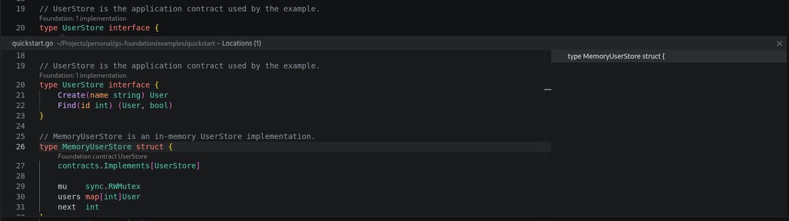

<div align="center">
  
  <h1>go-foundation v2</h1>
  <p>A Go application foundation with development-time checks.</p>
  <p>
    
    
    
  </p>
</div>

Foundation v2 keeps Go as the language and moves framework knowledge into tools
that can report errors while code is being written. Contracts are visible to the
compiler, route and action registries are generated, dependency wiring is checked,
and the VS Code extension connects Foundation metadata to editor navigation.

## Install

Until the first v2 release is tagged, install the CLI from a source checkout:

```sh
(cd dev && go install ./cmd/foundation)
```

After `v2.0.0` and `dev/v2.0.0` are published:

```sh
go get github.com/mirkobrombin/go-foundation/v2@v2.0.0
go install github.com/mirkobrombin/go-foundation/dev/v2/cmd/foundation@v2.0.0
```

The runtime module has no third-party dependencies. Development tools live in a
separate module and use the official Go analysis packages.

## Static workflow

Declare contracts and application metadata in normal Go:

```go
type UserStore interface {
    Find(int) (User, bool)
}

type MemoryUserStore struct {
    contracts.Implements[UserStore]
}

type GetUser struct {
    _     struct{} `method:"GET" path:"/users/{id:int}"`
    ID    int      `path:"id"`
    Users UserStore `inject:"users"`
}

func build() (*app.App, error) {
    application := app.New().Provide("users", NewMemoryUserStore())
    RegisterFoundation(application)
    _, err := application.Build()
    return application, err
}
```

Generate registration code and check the complete workspace:

```sh
foundation generate ./...
foundation check ./...
go test ./...
```

The generated file contains compile-time contract assertions and static
constructors for HTTP handlers and actions. Runtime reflection remains available
through `RegisterHTTP` and `RegisterActionHandler` for migration, but generated
registration is the v2 default.

See the [quickstart example](examples/quickstart/quickstart.go), exercised by its
own test.

Calling `App.Listen("")` binds to `127.0.0.1:8080`. Pass an explicit public
address only when the service is intended to accept remote traffic. Use
`App.ListenTLS` for direct HTTPS, or terminate TLS at a trusted reverse proxy.

## Layers

| Layer | Purpose | Examples |
|---|---|---|
| `core` | Runtime building blocks with no application dependency | contracts, caching, validation, configuration, events, telemetry |
| `app` | Application composition and boundaries | DI, HTTP, actions, dispatcher, hosting, testing |
| `dev` | Development-only analysis and generation | `foundation check`, `foundation generate` |
| `editors` | Editor-specific presentation | VS Code diagnostics, CodeLens, hover, contract and dependency navigation |

The analyzer enforces the dependency direction: `core` cannot import `app`, and
runtime packages cannot import `dev`.

## Development-time checks

`foundation check` reports:

- invalid `contracts.Implements[T]` declarations;
- invalid DI implementation and constructor registrations;
- duplicate or malformed routes and actions;
- route parameters without matching fields;
- locally missing or mistyped named dependencies;
- dispatches to locally unknown actions;
- invalid literal scheduler registrations;
- ignored binding errors;
- forbidden layer imports.

The compiler remains the authority for generated contract assertions. `go vet`,
tests, and the race detector remain part of the expected verification path.

## Editor navigation

A contract is a type parameter and a dependency is a struct tag, so a Go editor
cannot follow either on its own. The VS Code extension reads them and answers
the two questions that matter while writing code: what implements this, and
where does this come from.



The screenshot is the quickstart example. `UserStore` carries a CodeLens with
the number of implementations found in the workspace, and clicking it opens the
peek: the implementations on one side, the code of the selected one on the
other. `MemoryUserStore` declares the relationship with
`contracts.Implements[UserStore]`, which is also a CodeLens leading back to the
interface. The same navigation works between `inject:"users"` and
`Provide("users", ...)`, in both directions.

## Typed APIs

Named dependency keys can retain their Go type:

```go
var usersKey = di.NewKey[UserStore]("users")

builder := di.NewBuilder()
di.ProvideKey(builder, usersKey, store)
container, err := builder.Build()
users, ok := di.ResolveKey(container, usersKey)
```

Actions also have a typed path:

```go
router := actions.New()
create := actions.NewTyped[CreateUser, User]("users.create")
err := actions.HandleTyped(router, create, handler)
result, err := actions.DispatchTyped(ctx, router, create, payload)
```

Use strings where they are part of external metadata. Use typed APIs inside Go
code when the compiler can carry the relationship.

## Documentation

- [Project shape](docs/foundation-project.md)
- [Development tools](docs/development-tools.md)
- [V2 migration](docs/v2-migration.md)
- [Foundation Doctor](docs/foundation-doctor.md)
- [go-module-router migration](docs/go-module-router-migration.md)
- [VS Code extension](editors/vscode/README.md)

## License

MIT
